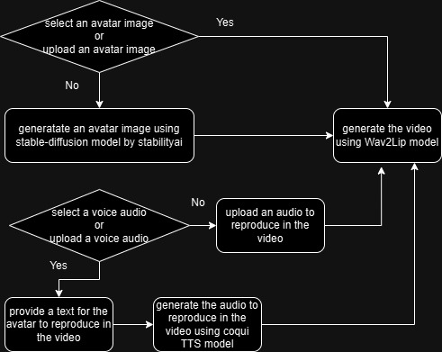

# AvatarVideoGenerator
The aim of the repository is to create an app which will allow to generate talking avatar videos.

The general pipeline of the app is represented in the image below.

## Websites providing similar service

Before working on the project I visited some websites that provide the similar service. Here are them: [Runway](https://runwayml.com/), [Nighcafe Creator](https://creator.nightcafe.studio/), and [Visper](https://visper.tech/en).

Of course, all of the websites provide a great content and services. Not surprisingly the options available for free users are not plausible in terms of the generated video's duration. Specifically, Runway allows to generate videos with duration of 4 seconds if you are a free user. Though Visper allows free users to create videos that last up to 20 seconds, it is also not a great deal. Finally Nightcafe Creator doesn't provide video generation service. But they have a service which generates image from text. 
